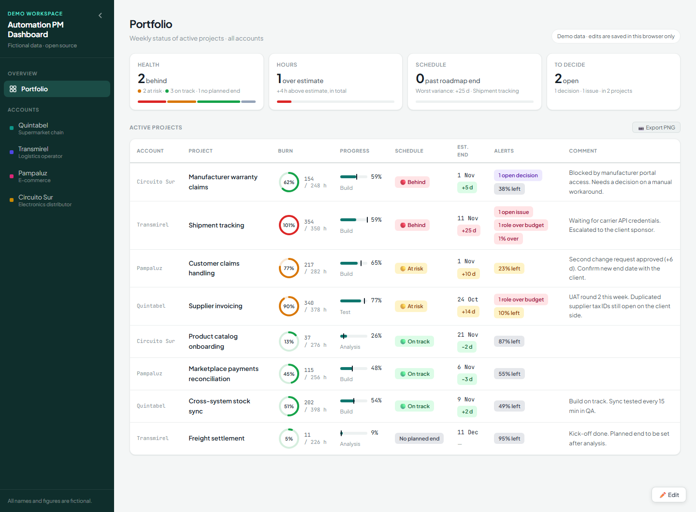
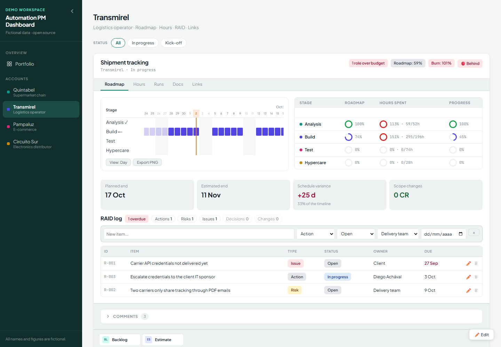

# Automation PM Dashboard

[English](README.md) · **Español**

Template de dashboard de una sola página para project managers de proyectos de automatización (RPA, workflows e integraciones). Muestra en un mismo lugar el roadmap, el consumo de horas, el registro RAID y el desvío contra el fin planificado de cada proyecto.

Funciona como sitio estático: sin build, sin backend y sin instalación. La demo trae **datos ficticios** (cuatro cuentas inventadas de retail y logística, nueve proyectos).

> **Demo online:** _agregá acá el link de GitHub Pages_
>
> 
> 
> _Capturas: agregalas en `docs/screenshots/`._

## Qué problema resuelve

En los proyectos de automatización el estado suele estar repartido: el roadmap en una slide, las horas en un export de la herramienta de carga, los riesgos en una planilla y la fecha comprometida en la cabeza de alguien. Este template los pone lado a lado para cada proyecto y permite responder rápido tres preguntas:

- ¿Estamos en plazo contra el fin planificado?
- ¿Cuánto del esfuerzo estimado ya consumimos, por etapa y por rol?
- ¿Qué nos está bloqueando y quién es el responsable?

## Para quién es

- PMs y líderes de delivery con varios proyectos de automatización en distintos clientes o áreas.
- Equipos que quieren una página de estado liviana, que se pueda hostear gratis y adaptar editando JavaScript simple.

## Funcionalidades

**Vista Portfolio**
- KPIs: proyectos activos, proyectos con alerta roja y consumo total de horas.
- Tabla con todos los proyectos: horas, barra de consumo, estado y alerta. Un clic en la fila abre el proyecto.

**Tableros por cuenta** (uno por cuenta, con filtro por estado)
- **Roadmap:** gantt con vista Día y Semana, línea de hoy, hitos, bloqueantes (días hábiles perdidos), marca de cierre y exportación a PNG.
- **Tabla de avance:** para cada etapa, tiempo transcurrido del roadmap vs. horas consumidas vs. % de avance manual.
- **Métricas de plazo:** fin planificado, fin estimado, desvío (días y %) y cambios de alcance (cantidad e impacto en días).
- **Badge de plazo:** 🟢 On track / 🟡 At risk / 🔴 Behind, además de Closed, No dates y No planned end.
- **Registro RAID:** acciones, riesgos, issues, decisiones y cambios, con estado, responsable, fecha comprometida, marca de vencido, filtros y lista de cerrados plegable.
- **Pestaña Hours:** consumo total, píldoras por etapa, una tarjeta por rol (con detalle por etapa y personas) y una matriz rol × etapa.
- **Pestañas Runs, Docs y Links:** esquema de ejecución productiva, checklist de entregables y links a backlog y estimación.
- **Comentarios:** bitácora fechada por proyecto.

**Edición** (botón ✏️ Edit, abajo a la derecha)
- Editor de roadmap: agregar, quitar y reordenar etapas, cambiar fechas, color y marca, y cargar bloqueantes, hitos y fecha de cierre. También se define el fin planificado; cambiarlo exige un motivo y cada cambio queda en un historial.
- Edición de % de avance, comentarios, checklist de documentos y links. Los ítems del RAID se pueden agregar y editar siempre.
- Cada cambio se guarda en el momento. Solo se guardan los campos editables desde la interfaz; horas, roles y estados salen siempre del archivo de datos.

**Otros**
- Tema claro y oscuro, según la configuración del sistema.
- Umbrales, etapas, feriados, orden de roles y checklist configurables en `config.js`.
- Historial de versiones de lo guardado, restaurable desde la consola del navegador.

## Inicio rápido

1. Descargá o cloná el repositorio.
2. Abrí `index.html` en el navegador. Listo.

Para cargar tus datos, editá `data/projects.js` (ver [docs/data-schema.md](docs/data-schema.md)). Para cambiar umbrales o etapas, editá `config.js` (ver [docs/metrics.md](docs/metrics.md)).

Para publicarlo, activá GitHub Pages en el repositorio (Settings → Pages → deploy desde la rama `main`, carpeta raíz).

## Documentación

La documentación detallada está en inglés:

- [Guía de uso](docs/usage.md): navegación, edición, almacenamiento y cómo restaurar versiones.
- [Métricas](docs/metrics.md): cada fórmula, umbral y cómo interpretarlo.
- [Esquema de datos](docs/data-schema.md): cómo cargar tus propias cuentas y proyectos.
- [Seguridad](SECURITY.md): qué no protege esta herramienta y cómo usarla de forma segura.

## Limitaciones

- **Sin login ni permisos.** Cualquiera que abra la página puede usar el modo Edit.
- **Sin base de datos: solo almacenamiento del navegador.** Lo editado se guarda en el navegador de cada visitante (backend simulado) y no se comparte. Si se borran los datos del navegador, se pierde. Para compartir, conectá tu propia base de datos con autenticación (ver [Connecting your own database](docs/usage.md#connecting-your-own-database)).
- **Las horas no se editan desde la interfaz.** Estimaciones, horas consumidas y roles se cargan en `data/projects.js`. No hay importación desde herramientas de carga de horas.
- **La columna "Alert" y los estados se escriben a mano** en el archivo de datos; no se calculan.
- **Los roadmaps guardados tienen prioridad.** Una vez que se edita el roadmap de un proyecto desde la interfaz, los cambios posteriores a ese roadmap en el archivo de datos se ignoran hasta que se borre lo guardado.
- **Un solo archivo, sin tests.** Está pensado para leerse y modificarse directamente, no como librería.
- Los nombres de etapas, meses y días están en inglés; no hay capa de traducción.

## Tecnología

HTML, CSS y JavaScript sin frameworks. Sin backend y sin llamadas de red (lo impone una Content-Security-Policy). Recursos externos: Google Fonts y [html2canvas](https://html2canvas.hertzen.com/) para exportar PNG, fijado con hash de integridad.

## Licencia

[MIT](LICENSE) © Elena Miranda
